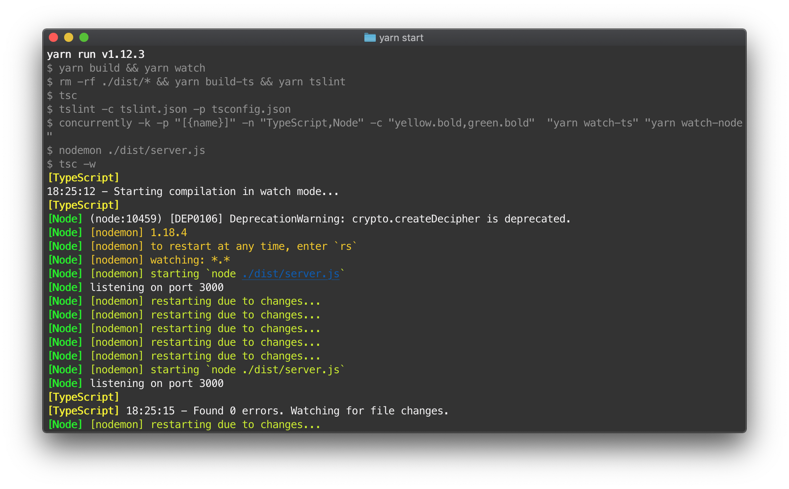

<div align="center">

# Minimalistic Express Boilerplate with TypeScript and Live Debugging



## Perfect for microservices.

</div>

---

### Pre-Configured:

- NodeJS
- Express
- TypeScript
- Live Debugging

### Pre-Installed:

- Body-Parser
- CORS

### Getting Started:

```node
// install the npm modules
yarn install

// start the live server
yarn start
```

---

### Questions?

Contact us at [meilenstein.io](https://meilenstein.io)
